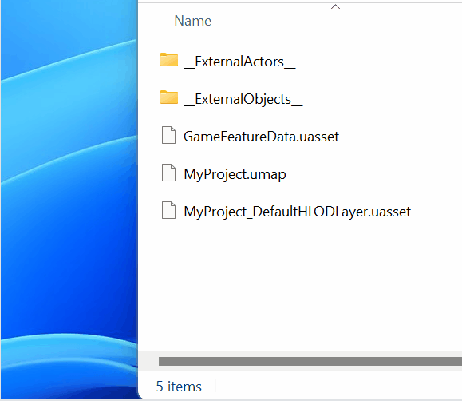
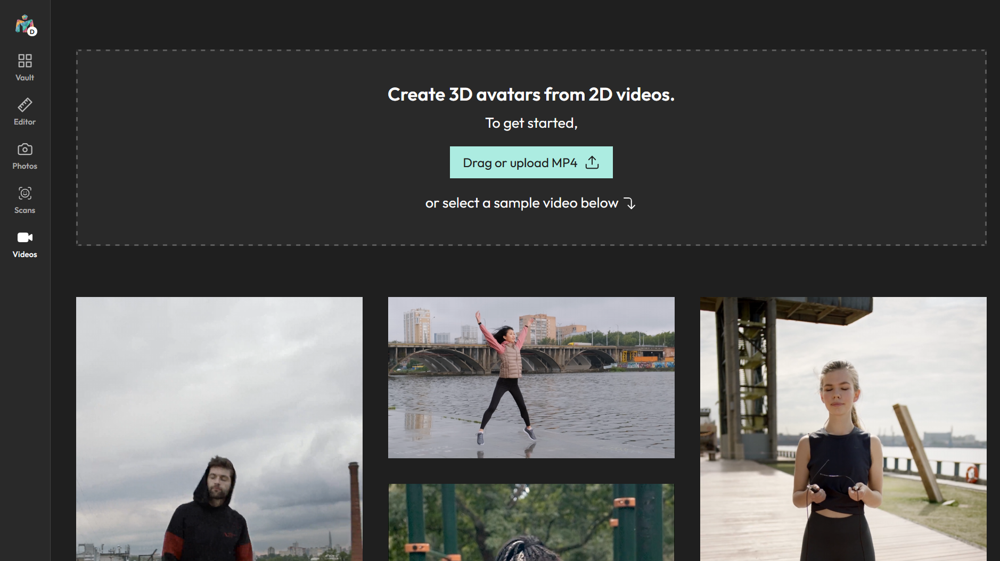
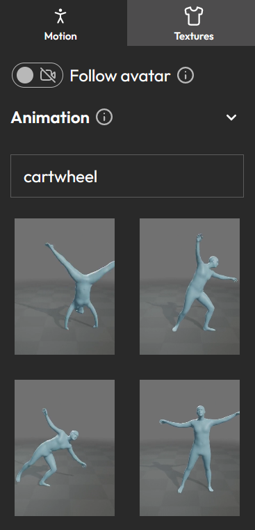
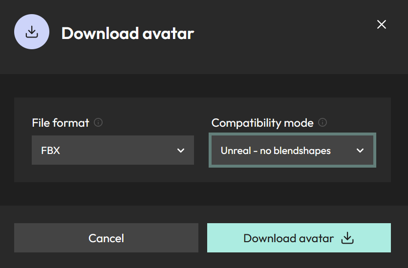
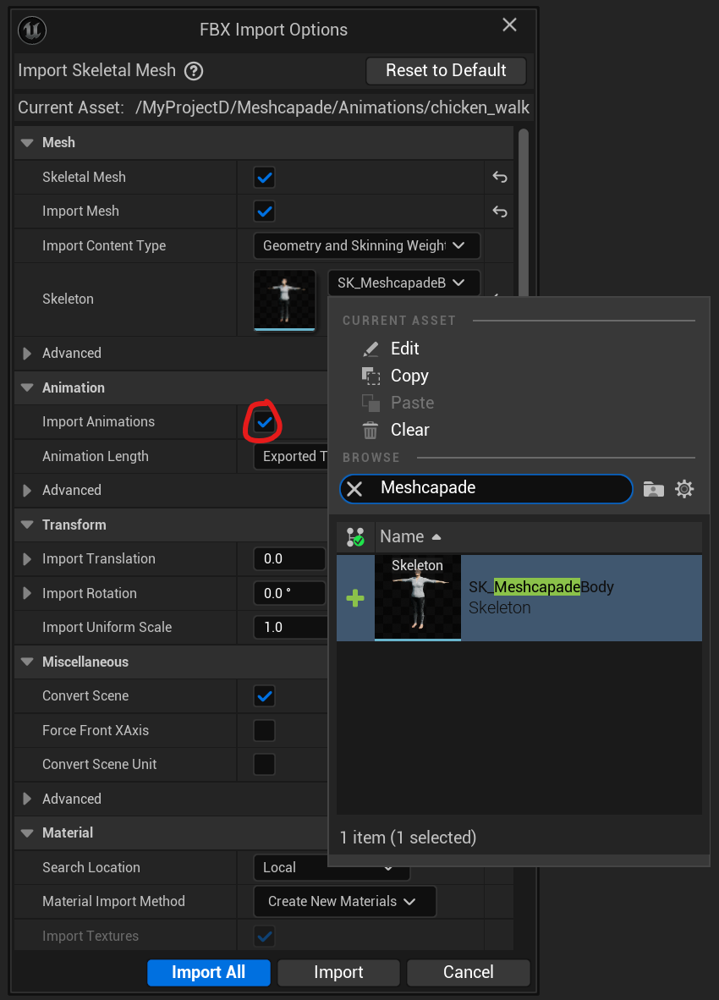
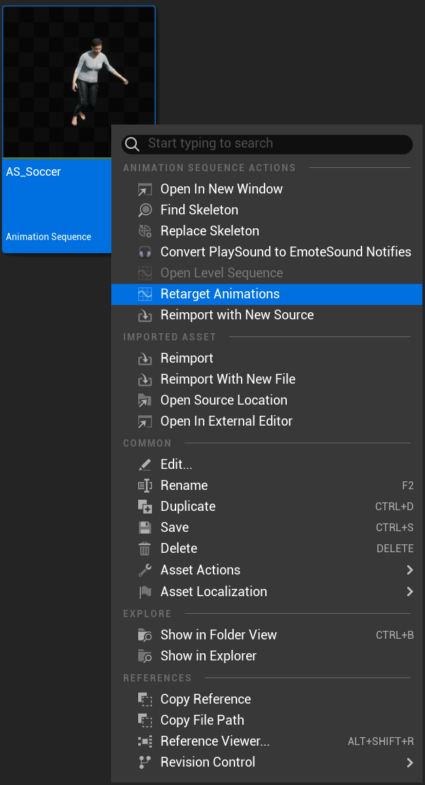
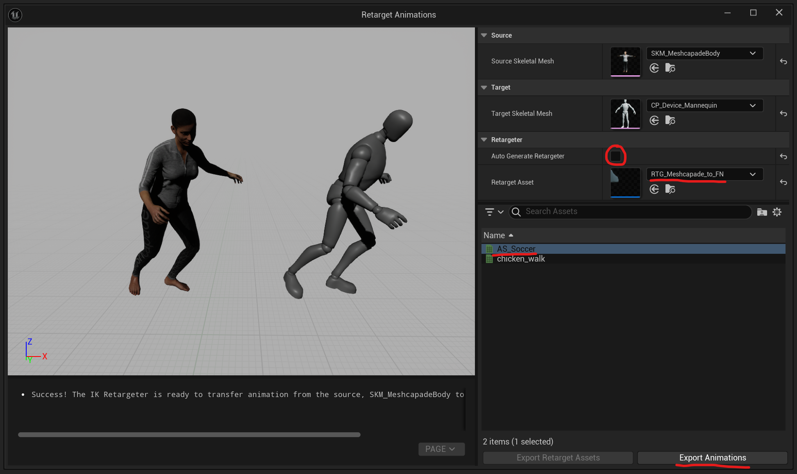
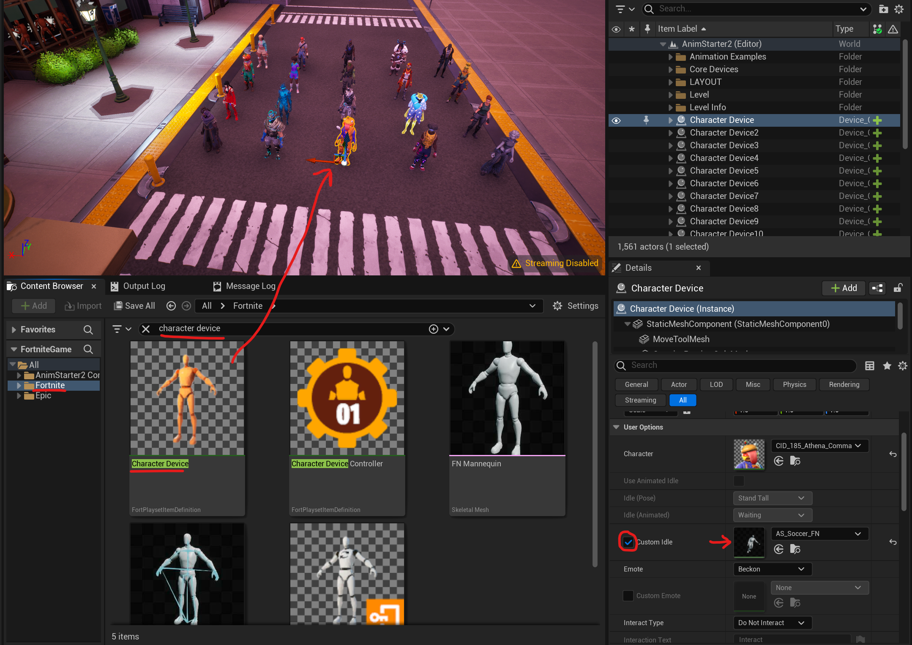

# Meshcapade Plugin for Unreal Editor for Fortnite (UEFN)

<!--
remove this once the page is actually live

For a better viewing experience, visit our <a href='https://me.meshcapade.com/integrations/uefn'>webpage</a>.

-->

This plugin allows you to quickly retarget motions created on the [Meshcapade.me](https://me.meshcapade.com/) platform onto your own characters in [Unreal Editor for Fortnite](https://store.epicgames.com/en-US/p/fortnite--uefn). Bodies created on the Meshcapade platform are created using the [SMPL](https://smpl.is.tue.mpg.de/) core technology, and are thus referred to as [SMPL-bodies](https://smpl.is.tue.mpg.de/license.html).

This plugin was developed in Fortnite 29.20 (Unreal Engine: 5.4.0).  Unreal Engine for Fortnite is currently in Beta.

I. Adding the plugin to your UEFN project

[Download](https://github.com/Meshcapade/mc-uefn) the UEFN directly, or grab from our [git repo](https://github.com/Meshcapade/mc-uefn).

Once you have the plugin downloaded, unzip the plugin and put the `Content` folder of your UEFN project.

 

II. Getting an animation from <a href='https://me.meshcapade.com' target='_blank'>Meshcapade.me</a>

Currently, there are two ways to get animations from [Meshcapade.me](https://me.meshcapade.com/):
- [Motion from video](https://me.meshcapade.com/from-videos) - extract the human motion from a video.

- [Motion from text](https://me.meshcapade.com/editor) - find a human motion in our library of thousands of motions.

### A. [Motion from video](https://me.meshcapade.com/from-videos)
To get an animation from a video, visit the Meshcapade [motion from video](https://me.meshcapade.com/from-videos) page.  Follow the prompts until you've created an animated avatar.

### B. [Motion from text](https://me.meshcapade.com/editor)
To search for a motion from our motion library, visit the Meshcapade [editor](https://me.meshcapade.com/editor) page. On the top right, there is a search box where you can find animation.  Once you've found the animation you want, save the avatar into your vault.

 

III. Downloading the animation 

Go to your [avatar vault](https://me.meshcapade.com/vault), and click the `...` on the top right corner of the avatar containing the motion you'd like to download, and click `download`.  In the download options, make sure that `file format` is `.FBX` (`.OBJ` has no motion) and that `Pose/Motion` is `Captured Motion`.  For `compatibility mode`, select `Unreal - no blend shapes`.

IV. Importing the .FBX into UEFN

With the .FBX downloaded, import it into your UEFN project (File > Import).

Set the skeleton to `SK_MeshcapadeBody`.

📝 Make sure that `Import Animation` is checked.

V. Retargeting the animation

In UEFN, the process of transferring an animation from one character to another is called retargeting.  This plugin comes with a SMPL-body to Fortnite retargeter.

### A. Using the Retargeter

To retarget an animaiton from a SMPL-body onto a Fortnite character, right click on an animation and choose `Retarget Animations`

To use our retargeter:
- Uncheck `Auto Generate Retargeter`
- Change the Retarget Asset to `RTG_Meshcapade_to_FN`
- Double click the animation you'd like to retarget (`AS_Soccer` in this example)
- Then select `Export Animations`

Choose where you would like to export it, and then click export.

You can now use this animation with any Fortnite character.  For example, the video below has the retargeted soccer animation assigned to the `Custom Idle` variable on several Fortnite `Character Device` objects.

